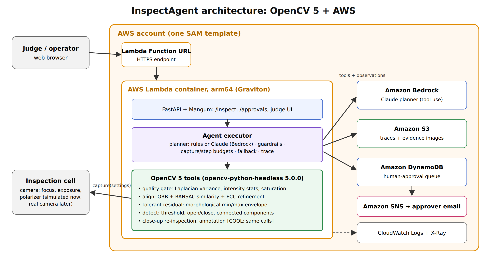

# InspectAgent

Agentic visual inspection built on **OpenCV 5** and **AWS**. An agent looks at a machined part,
judges the image with OpenCV 5, changes camera settings when the image is poor, takes a close-up
when the evidence is ambiguous, and then passes, rejects, or asks a human to approve a lot
quarantine. Every OpenCV measurement and the decision it caused is recorded in a trace.

Entry for the OpenCV AI Competition 2026 (Agentic Vision path, with an optional COOL on Graviton track).



## Repository layout

| Path | What it is |
|---|---|
| `inspectagent/vision.py` | OpenCV 5 tools: quality gate, ORB+RANSAC+ECC alignment, tolerant residual, defect detection, close-up |
| `inspectagent/camera.py` | Reproducible synthetic inspection cell (parts, defects, blur/exposure/glare/pose, controllable camera) |
| `inspectagent/agent.py` | Executor with guardrails, rule planner, Claude-on-Bedrock planner, trace |
| `inspectagent/store.py` | Traces/evidence to S3, approvals to DynamoDB + SNS (local files when offline) |
| `inspectagent/api.py` | FastAPI app + Mangum handler (Lambda Function URL) with a judge UI |
| `eval/run_eval.py` | Agent vs. static one-shot pipeline; accuracy, false accept/reject, escalations, latency |
| `bench/bench_ops.py` | Per-op latency of the OpenCV workload (stock wheel vs. COOL; arm64 vs. x86) |
| `deploy/` | Dockerfile (Lambda arm64) and SAM template (S3, DynamoDB, SNS, Lambda, Bedrock access) |
| `docs/REPORT.md` / `.pdf` | Technical report |
| `docs/diagrams/` | Architecture and agent workflow diagrams (PNG + SVG) |
| `docs/evidence/` | Agent traces showing OpenCV output driving decisions, guardrail, fallback, failure case |
| `docs/REQUIREMENTS.md` | Checklist of every submission requirement and where it is met |
| `docs/` (other) | Plan, COOL procedure, video script, mermaid diagrams |

## Quick start (local, no AWS needed)

```bash
python3.12 -m venv .venv && . .venv/bin/activate
pip install -r requirements-dev.txt
pytest                                   # 12 tests
python -m eval.export_evidence           # regenerate docs/evidence/
python -m eval.run_eval --n 200 --seed 11
uvicorn inspectagent.api:app --reload    # open http://127.0.0.1:8000
```

## Claude on Amazon Bedrock planner

```bash
export AWS_REGION=us-east-1 BEDROCK_MODEL_ID=anthropic.claude-opus-5-5
python -m eval.run_eval --n 40 --planner claude
```
Enable model access for Claude in the Bedrock console first. If the planner errors or refuses,
the loop falls back to the rule planner and logs a `planner_error` event in the trace.

## Deploy to AWS (Graviton)

```bash
cd deploy
sam build --use-container
sam deploy --guided            # Architecture=arm64 (default), optional ApproverEmail
```
The `DemoUrl` output is the judge endpoint. Deploy a second stack with `Architecture=x86_64`
to measure the arm64 vs. x86 difference.

## Evaluation results (synthetic, seed 11, 200 parts, rule planner)

| metric | static baseline | agent |
|---|---|---|
| pass/fail accuracy | 0.720 | 0.990 |
| false accept rate (defective part passed) | 0.160 | 0.020 |
| false reject rate (good part failed) | 0.400 | 0.000 |
| decision matches policy | 0.605 | 0.970 |
| mean captures per part | 1 | 1.8 |
| mean latency (x86 dev box) | 86 ms | 128 ms |

Known failure: a faint spot on a part first captured badly underexposed can slip through
(2 of 100 defective parts). See `docs/REPORT.md` for limitations.
