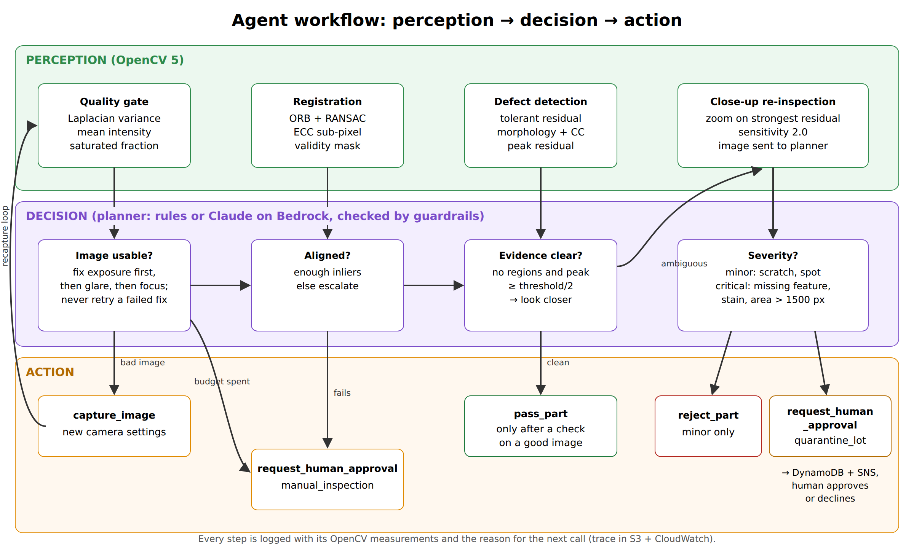

# InspectAgent: Agentic Visual Inspection with OpenCV 5 on AWS

**Technical report, OpenCV AI Competition 2026 (powered by AWS)**
Team: *[team name and members]* · Path: Agentic Vision (COOL optional) ·
Code: https://github.com/najmunnaharhira/OpenCV-AI-Competition-2026-powered-by-AWS

> Items marked **[after deploy]** are filled in once the AWS stack is running. Everything else is
> reproducible from the repository today.

## 1. Problem

Automated visual inspection is usually one-shot. One image is captured, one fixed pipeline runs, and the
part passes or fails. On a production line the image itself is often the weak point. Parts arrive rotated
or shifted, focus drifts, lighting changes, and reflective surfaces produce glare. A one-shot system has
no way to tell "the part is bad" apart from "the photo is bad". It lets defects escape (false accepts)
and scraps good parts (false rejects), and operators stop trusting it.

A human inspector handles this by looking again under better conditions, leaning in when unsure, and
calling a supervisor before taking a costly action. InspectAgent gives an automated system the same
behaviour. OpenCV 5 measurements decide every next step.

## 2. Users and impact

- **Quality engineers on small and mid-size production lines** who cannot afford a bespoke, perfectly
  controlled vision cell.
- **Line supervisors**, who are asked only for decisions that need a person (lot quarantine), with the
  image evidence attached.
- **Auditors**, who get a complete trace of what was measured and why each decision was taken.

The intended impact is fewer escaped defects, fewer false rejects, and human attention spent only on the
calls that need it.

## 3. Architecture


*Figure 1. System architecture. Source: `docs/diagrams/architecture.svg`.*

| Component | Role |
|---|---|
| AWS Lambda (container, **arm64 / Graviton**), Function URL | Hosts the API, the agent executor and the OpenCV 5 tools |
| Amazon Bedrock (Claude) | Optional LLM planner that picks the next tool from OpenCV observations |
| Amazon S3 | Per-inspection trace JSON and evidence images (captures, annotated image, close-up) |
| Amazon DynamoDB | Queue of human-approval requests with status, reviewer and timestamps |
| Amazon SNS | Notifies the approver by email when a request is created |
| CloudWatch Logs and X-Ray | One JSON log line per agent step, plus request tracing |
| AWS SAM | One template deploys everything (`deploy/template.yaml`) |

The camera sits behind a small interface (`capture(part, settings)`). Today it is a reproducible
simulator, so judges can re-run every result. A real camera driver or an S3 image source can replace it
without changing the agent.

## 4. OpenCV 5 implementation

All image analysis uses OpenCV 5.0.0 (`opencv-python-headless==5.0.0.93`, wheels for x86_64 and aarch64).
`GET /healthz` reports the running version and CPU architecture. Source: `inspectagent/vision.py`.

**Quality gate.** Sharpness is the variance of the Laplacian, $S = \operatorname{Var}(\nabla^2 I)$. The image
is blurry if $S < 120$. Exposure is judged from mean intensity (under 60 or over 170). Glare is
judged from the fraction of saturated pixels (over 2%).

**Registration.** ORB features (2,000) are matched with a cross-checked Hamming matcher. A 4-DoF similarity
is fitted with RANSAC (`estimateAffinePartial2D`) and refined to sub-pixel accuracy with ECC
(`findTransformECC`, Euclidean motion). A warped validity mask excludes pixels the camera did not see.
An earlier version used a full homography, which extrapolated badly at the part edges and produced false
defects. The similarity fit plus ECC removed them.

**Misalignment-tolerant residual.** After matching gain and offset inside the valid area, a pixel only
counts as different if it falls outside the local range of the reference:

$$ R(x) = \max\big(I(x) - \max_{N(x)} T,\; \min_{N(x)} T - I(x),\; 0\big) $$

where $N(x)$ is a 5×5 neighbourhood, computed with `dilate` and `erode`. This tolerates about 2 px of
residual misregistration at strong edges.

**Detection.** The residual is thresholded (30 at sensitivity 1.0, 15 at 2.0), cleaned with morphological
open and close, and split with `connectedComponentsWithStats`. Blobs under 25 px are ignored. A
shape heuristic labels each region as scratch, spot, or stain/missing feature.

**Close-up.** The agent can zoom into the strongest residual and re-run detection at double sensitivity
within that region only. The close-up image is also sent to the LLM planner.

## 5. Agent design



*Figure 2. Perception, decision and action loop.*

**Tools:** `capture_image(refocus, exposure, polarizer)`, `align_to_reference`, `detect_defects(sensitivity)`,
`inspect_closeup(bbox)`, `pass_part`, `reject_part`, `request_human_approval(quarantine_lot | manual_inspection)`.

**Planners.** Both planners use the same tools.

- *Rule planner:* a deterministic policy, used as the offline baseline and as the fallback.
- *Claude on Amazon Bedrock:* Claude receives each tool result as JSON (and the close-up as an image)
  and chooses the next call through tool use. Source: `inspectagent/agent.py`, `ClaudePlanner`.

**Guardrails.** These are enforced in the executor, so they hold whichever planner is driving:

- `pass_part` is refused unless a defect check ran on an image that passed the quality gate.
- `pass_part` is refused if any defect was found.
- `reject_part` is refused for critical defects. These must go to `request_human_approval(quarantine_lot)`.
- There is a budget of 4 captures and 12 steps. Exhausting either escalates to a human.
- If the planner raises an error or refuses, the loop logs a `planner_error` event and continues with the rule planner.

**Evidence that OpenCV output changes later tool calls** (full traces in `docs/evidence/`):

| step | tool | OpenCV 5 output | next action and why |
|---|---|---|---|
| 1 | `capture_image` (default) | sharpness = 83.7, issues = [blurry] | recapture with `refocus=true`, because 83.7 < 120 |
| 2 | `capture_image` (refocus) | sharpness = 261.1, issues = none | align |
| 3 | `align_to_reference` | 381 inliers, ECC 0.9999, rotation 3.0° | detect at sensitivity 1.0 |
| 4 | `detect_defects` | peak residual 3.0, 0 regions | `pass_part` |

In `docs/evidence/02-glare-and-faint-defect`, 3.6% saturated pixels trigger the polarizer. A residual peak
of 25 against a threshold of 30 then triggers `inspect_closeup`, which finds the defect and rejects
the part. In `docs/evidence/04-guardrail-blocks-planner`, a planner tries to auto-reject a missing hole.
The executor blocks it and the planner escalates to a human.

## 6. AWS deployment

`deploy/template.yaml` (AWS SAM) creates the Lambda container function on **arm64**, a public Function URL
for judging, a private S3 bucket with 60-day expiry, a DynamoDB on-demand table, an SNS topic with an
optional email subscription, X-Ray tracing, and IAM permissions for S3, DynamoDB, SNS and Bedrock.
`sam deploy --parameter-overrides Architecture=x86_64` deploys the same stack on x86 for comparison.

**[after deploy]** Demo URL, region, memory size, cold and warm latency for arm64 and x86, and cost per
1,000 inspections.

## 7. Evaluation

**Setup.** 200 synthetic parts (`make_dataset(200, seed=11)`). Half are defective: scratch, stain,
missing hole and faint spot in equal numbers. Each part has one capture nuisance: none, blur,
under-exposure, over-exposure or glare (40 each), plus a random pose of ±6° and ±15 px.
The **baseline** is the same OpenCV detector run once on the default capture, with no adaptation.
Reproduce with `python -m eval.run_eval --n 200 --seed 11`. Results are in `eval/results/`.

| metric | static baseline | InspectAgent (rules) |
|---|---|---|
| pass/fail accuracy | 72.0% | **99.0%** |
| false accept rate (defective part passed) | 16.0% | **2.0%** |
| false reject rate (good part failed) | 40.0% | **0.0%** |
| decision matches policy (pass / reject / escalate) | 60.5% | **97.0%** |
| escalation rate | 53.5% | 23.0% |
| mean captures per part | 1.0 | 1.8 |
| mean steps per part | – | 4.9 |
| close-ups taken | – | 21 |
| mean latency per part (x86 dev machine) | 86 ms | 128 ms |

Accuracy by capture problem:

| capture problem | n | baseline | agent |
|---|---|---|---|
| none | 40 | 90.0% | 100% |
| blur | 40 | 50.0% | 97.5% |
| under-exposure | 40 | 90.0% | 100% |
| over-exposure | 40 | 80.0% | 97.5% |
| glare | 40 | 50.0% | 100% |

The expected decisions are pass for clean parts, reject for scratches and faint spots, and human approval
for missing holes and stains. The agent's 3% of policy mismatches are 4 stains labelled as minor spots
(rejected rather than escalated) and the 2 missed faint spots.

**Failure handling and human control** are covered by tests (`tests/test_pipeline.py`) and evidence cases:
the guardrail block (`04`), the planner fallback (`05`), and escalation when the capture budget runs
out or a remedy has no effect.

**Observability.** Every step is logged as one JSON line with session, part, tool, arguments, OpenCV
output, reason, planning time and tool time. The full trace and evidence images go to S3, and the UI
shows the same trace.

**[after deploy]** Claude-planner results on the same split (`--planner claude`): accuracy, steps, tokens,
fallbacks and latency.

## 8. Failure cases and limitations

- **Missed faint spots (2 of 100 defective parts).** One example is in `docs/evidence/06-failure-case`. The
  residual stays below even the close-up threshold. Lowering that threshold further would add false alarms.
- **Stains labelled as spots (4 parts).** The shape heuristic misses some round stains, so they are rejected
  rather than escalated. This is safe for the part, but the lot decision is skipped.
- **Synthetic data.** The cell is deliberately simple. Real parts have texture, tolerances and specular
  surfaces, so absolute numbers will be lower. Evaluation on real images is the next step.
- **Golden-reference method.** This needs a reference image per part type and a roughly fixed fixture.
  Large pose changes or deformable parts would need a learned model.
- **Latency.** Adaptation costs about 1.5× the baseline time per part, almost all of it in extra captures and registration.

## 9. Responsible use

- **Human control.** Line-level actions (lot quarantine) always need human approval. The executor
  enforces this, not the prompt.
- **Safe failure.** An unusable image, failed alignment, an exhausted budget or a planner error leads to
  escalation or fallback, never a silent pass.
- **Accountability.** Every decision carries the measurements and reasons behind it. Approvals record
  the reviewer and the time.
- **Privacy.** Images show parts, not people. The evidence bucket is private with a 60-day expiry.
- **Exposure.** The public demo URL is for judging only and should be switched to IAM auth afterwards.

## 10. Optional: COOL on Graviton

Method and status are in `docs/COOL.md`. **[after deploy]** COOL version, instance type, and results
compared with the stock wheel.

## 11. Reproducibility

```bash
pip install -r requirements-dev.txt
pytest                                    # 12 tests
python -m eval.run_eval --n 200 --seed 11 # Section 7
python -m eval.export_evidence            # docs/evidence/
python -m bench.bench_ops --label stock   # per-op latency
```
