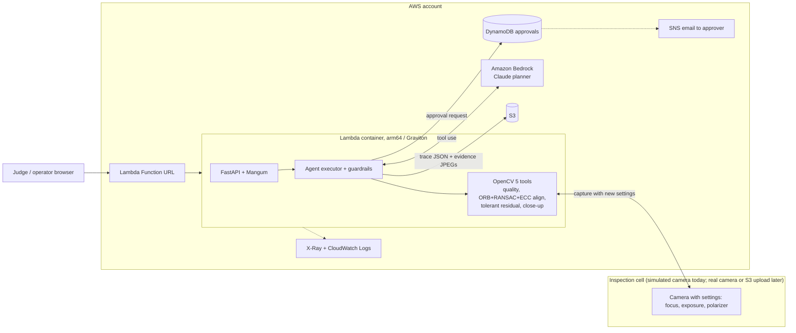
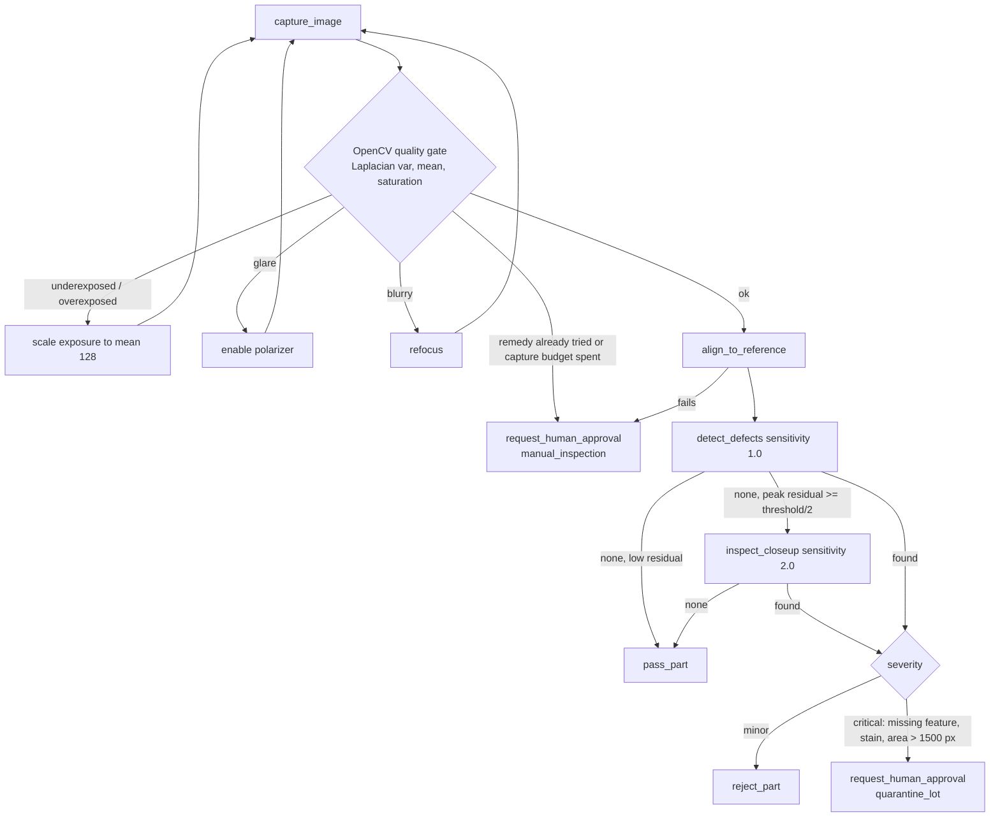

# Architecture

Rendered diagrams: [architecture.png](diagrams/architecture.png), [agent_workflow.png](diagrams/agent_workflow.png). The mermaid versions below render on GitHub.

## System (OpenCV 5 + AWS)

## Agent loop (perception, decision, action)

Guardrails enforced by the executor regardless of planner: no pass without a defect check on a
good-quality image; no auto-reject of a critical defect; at most 4 captures and 12 steps; planner
errors or refusals fall back to the rule planner and are logged.

## COOL path (optional, Best Use of COOL award)

Run `bench/bench_ops.py` on a Graviton EC2 instance with the stock wheel and with COOL from AWS
Marketplace, then serve the COOL build in the Lambda/ECS arm64 image. The claimed core workload is
the OpenCV part of each inspection (`align_to_reference` + `detect_defects`).
