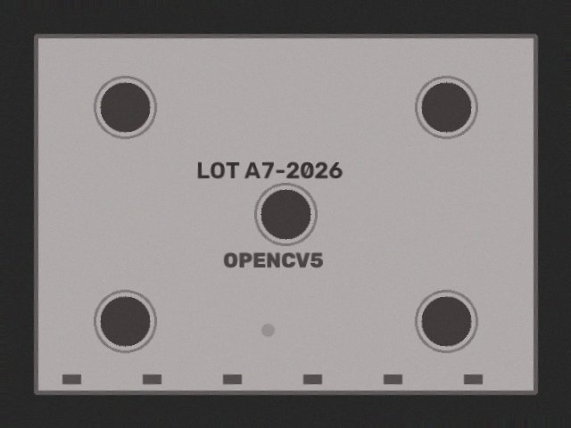
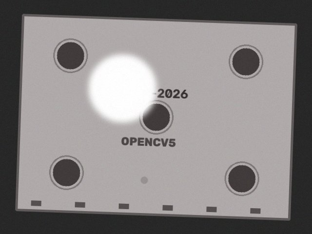
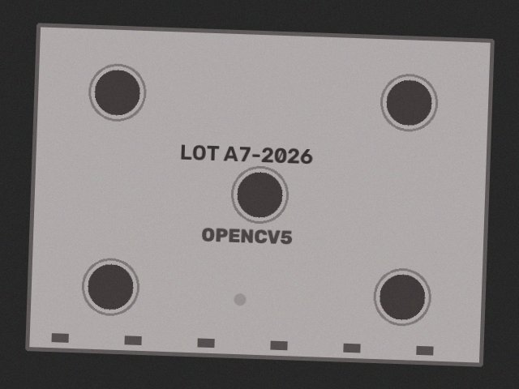
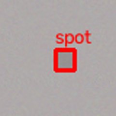

# Glare plus a faint defect: polarizer, then a close-up

Saturated pixels trigger the polarizer. The defect is below the production threshold, but the residual peak is close to it, so the agent takes a close-up at higher sensitivity and finds it.

Ground truth: `[{'kind': 'faint_spot', 'x': 300, 'y': 370}]`  
Outcome: **reject**  (defects ['spot'], area 142px)

| step | tool | arguments | OpenCV 5 output | why this step |
|---|---|---|---|---|
| 1 | `capture_image` | `{"refocus": false, "exposure": 1.0, "polarizer": false}` | sharpness=242.7 mean=133.2 glare=0.0358 issues=['glare'] | start with default camera settings |
| 2 | `capture_image` | `{"refocus": false, "exposure": 1.0, "polarizer": true}` | sharpness=261.1 mean=128.7 glare=0.0 issues=none | glare: 3.6% saturated pixels -> enable polarizer |
| 3 | `align_to_reference` | `{}` | inliers=402 ecc=0.9999 rotation=-2.0 deg | image quality ok -> register to reference |
| 4 | `detect_defects` | `{"sensitivity": 1.0}` | threshold=30.0 peak_residual=25.0 regions=0 [] | aligned -> production defect check |
| 5 | `inspect_closeup` | `{"bbox": []}` | threshold=15.0 peak_residual=25.0 regions=1 ['spot'] | no defect but peak residual 25.0 >= half threshold 30.0 -> take a closer look |
| 6 | `reject_part` | `{"rationale": "defects ['spot'], area 142px"}` | {"ok": true} | minor defect -> auto reject |

   
