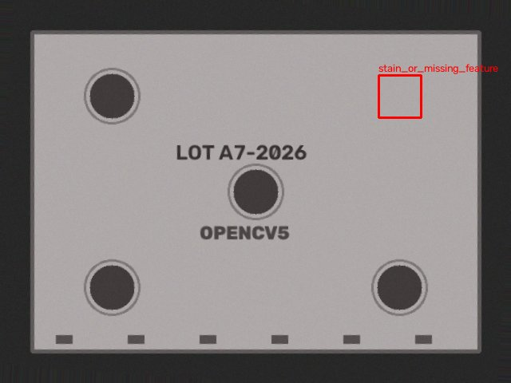
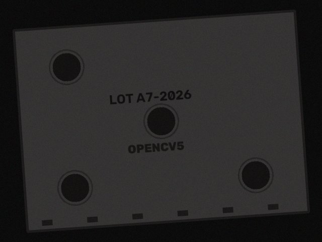
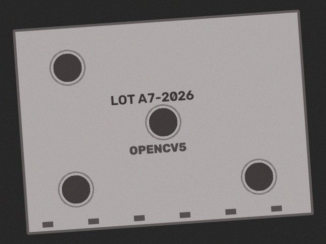

# Missing hole: critical defect goes to a human

Exposure is fixed first. The missing feature is critical, so the agent asks a human to approve a lot quarantine.

Ground truth: `[{'kind': 'missing_hole', 'hole': 1}]`  
Outcome: **human_review** quarantine_lot (critical defect ['stain_or_missing_feature'], area 2129px)

| step | tool | arguments | OpenCV 5 output | why this step |
|---|---|---|---|---|
| 1 | `capture_image` | `{"refocus": false, "exposure": 1.0, "polarizer": false}` | sharpness=97.6 mean=38.6 glare=0.0 issues=['blurry', 'underexposed'] | start with default camera settings |
| 2 | `capture_image` | `{"refocus": false, "exposure": 3.316, "polarizer": false}` | sharpness=244.9 mean=129.0 glare=0.0 issues=none | underexposed: mean intensity 38.6 -> scale exposure |
| 3 | `align_to_reference` | `{}` | inliers=384 ecc=0.9846 rotation=4.0 deg | image quality ok -> register to reference |
| 4 | `detect_defects` | `{"sensitivity": 1.0}` | threshold=30.0 peak_residual=111.0 regions=1 ['stain_or_missing_feature'] | aligned -> production defect check |
| 5 | `request_human_approval` | `{"proposed_action": "quarantine_lot", "rationale": "critical defect ['stain_or_missing_feature'], area 2129px"}` | {"ok": true, "status": "pending"} | critical -> line action needs human approval |

  
