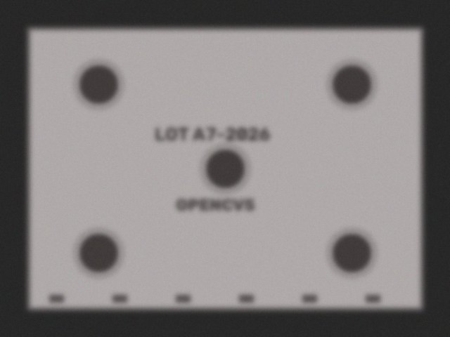
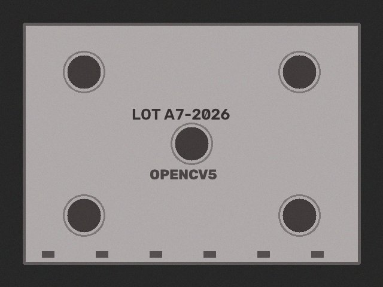

# Failure handling: the LLM planner is unavailable

The Claude planner raises an error, the loop logs it and continues with the rule planner.

Ground truth: `no defect`  
Outcome: **pass**  (no defects; peak residual 3.0)

| step | tool | arguments | OpenCV 5 output | why this step |
|---|---|---|---|---|
| 1 | *planner_error* | | Bedrock unreachable | fallback: rules |
| 1 | `capture_image` | `{"refocus": false, "exposure": 1.0, "polarizer": false}` | sharpness=83.6 mean=128.7 glare=0.0 issues=['blurry'] | start with default camera settings |
| 2 | `capture_image` | `{"refocus": true, "exposure": 1.0, "polarizer": false}` | sharpness=505.0 mean=128.7 glare=0.0 issues=none | blurry: Laplacian variance 83.6 < 120.0 -> refocus |
| 3 | `align_to_reference` | `{}` | inliers=482 ecc=1.0 rotation=-0.0 deg | image quality ok -> register to reference |
| 4 | `detect_defects` | `{"sensitivity": 1.0}` | threshold=30.0 peak_residual=3.0 regions=0 [] | aligned -> production defect check |
| 5 | `pass_part` | `{"rationale": "no defects; peak residual 3.0"}` | {"ok": true} | clean |

  
