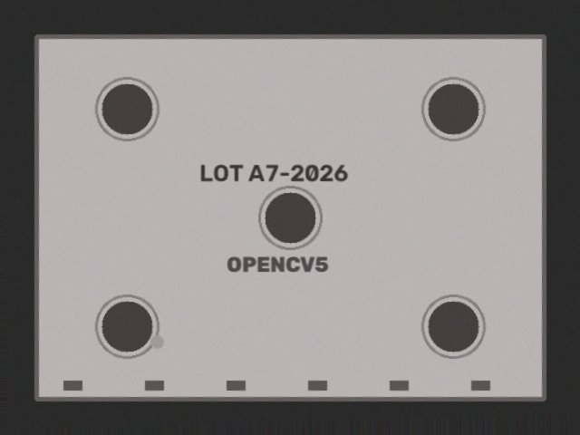
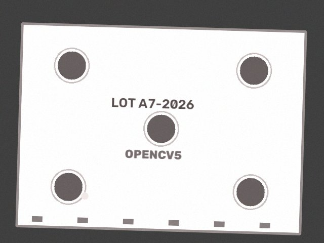
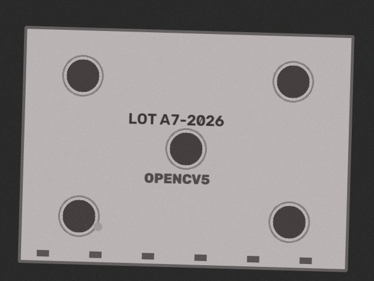
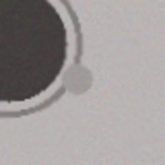

# Known failure: faint spot missed

From the seed-11 evaluation. The defect stays below even the close-up threshold, so the part passes. This is one of the 2 false accepts out of 100 defective parts.

Ground truth: `[{'kind': 'faint_spot', 'x': 173, 'y': 377}]`  
Outcome: **pass**  (close-up found nothing)

| step | tool | arguments | OpenCV 5 output | why this step |
|---|---|---|---|---|
| 1 | `capture_image` | `{"refocus": false, "exposure": 1.0, "polarizer": false}` | sharpness=434.4 mean=193.3 glare=0.6373 issues=['overexposed', 'glare'] | start with default camera settings |
| 2 | `capture_image` | `{"refocus": false, "exposure": 0.662, "polarizer": false}` | sharpness=272.4 mean=136.4 glare=0.0 issues=none | overexposed: mean intensity 193.3 -> scale exposure |
| 3 | `align_to_reference` | `{}` | inliers=415 ecc=0.9999 rotation=-1.64 deg | image quality ok -> register to reference |
| 4 | `detect_defects` | `{"sensitivity": 1.0}` | threshold=30.0 peak_residual=25.0 regions=0 [] | aligned -> production defect check |
| 5 | `inspect_closeup` | `{"bbox": []}` | threshold=15.0 peak_residual=25.0 regions=0 [] | no defect but peak residual 25.0 >= half threshold 30.0 -> take a closer look |
| 6 | `pass_part` | `{"rationale": "close-up found nothing"}` | {"ok": true} | close-up clean |

   
